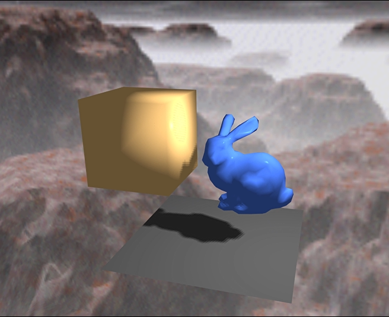

# CS-GY 6533 A – Interactive Computer Graphics - Fall 2021

### Assignment 4

*Yangfan Zhou*

<yz8338@nyu.edu>

# Implementation & Result

## Shadow Mapping

* Light Source

The circular movement of the light source is specified by changing the x, z coordinates each frame according to time at the beginnging of each render loop by the following lines:
```bash
auto t_now = std::chrono::high_resolution_clock::now();
float time = std::chrono::duration_cast<std::chrono::duration<float>>(t_now - t_start).count();
lightPos = glm::vec3(light_r * cos(glm::radians(time * 10)), 1.0f, light_r * sin(glm::radians(time * 10)));
```

* Plane and Objects Render

The plane and objects are rendered in renderScence function. By passing vertex shader, fragment shaders, lightSpaceMatrix and depthMap into this function, it basically use stencil buffer when rendering each object. Hence each object is assigned with incrementing stencil index, which is used for object picking. Everytime an object is clicked, assign the stencil index into global variable 'index'. The default value of 'index' is '0', which corresponds to the plane. If no object is selected, all operations will be done on the plane.
```bash
void renderScene(Program &program, GLFWwindow* window, glm::mat4 &lightSpaceMatrix, const string &vs, const string &fs, const string &fs_m, const string &fs_r, unsigned int &depthMap) {
    // Get size of the window
    int width, height;
    glfwGetWindowSize(window, &width, &height);
    float aspect_ratio = float(height)/float(width);
    view = glm::lookAt(cameraPos, glm::vec3(0.0, 0.0, 0.0), glm::vec3(0.0, 1.0, 0.0));
    projection = glm::perspective(glm::radians(45.0f), 1/aspect_ratio, 0.5f, 150.f);

    // Enable stencil operations
    glEnable(GL_STENCIL_TEST);
    glStencilOp(GL_KEEP, GL_KEEP, GL_REPLACE);

    glStencilFunc(GL_ALWAYS, 0, -1);

    // Draw plane
    VAOs[0].bind();
    
    program.init(vs,fs,"outColor");
    program.bind();

    glActiveTexture(GL_TEXTURE0);
    glBindTexture(GL_TEXTURE_2D, depthMap);

    glUniformMatrix4fv(program.uniform("model"), 1, GL_FALSE, glm::value_ptr(model[0]));
    glUniformMatrix4fv(program.uniform("view"), 1, GL_FALSE, glm::value_ptr(view));
    glUniformMatrix4fv(program.uniform("projection"), 1, GL_FALSE, glm::value_ptr(projection));
    glUniformMatrix4fv(program.uniform("lightSpaceMatrix"), 1, GL_FALSE, glm::value_ptr(lightSpaceMatrix));

    if (shadowColorBlack == 1) {
        glUniform3f(program.uniform("shadowColor"), 0.0f, 0.0f, 0.0f);
    } else {
        glUniform3f(program.uniform("shadowColor"), 1.0f, 0.0f, 0.0f);
    }

    glUniform3f(program.uniform("lightColor"), 1.0f, 1.0f, 1.0f);
    glUniform3f(program.uniform("objectColor"), 0.3f, 0.3f, 0.3f);
    glUniform3f(program.uniform("lightPos"), lightPos[0], lightPos[1], lightPos[2]);
    glUniform3f(program.uniform("viewPos"), cameraPos[0], cameraPos[1], cameraPos[2]);
    program.bindVertexAttribArray("position", VBOs[0]);
    program.bindVertexAttribArray("normal", vNBOs[0]);
    glDrawArrays(GL_TRIANGLES, 0, 6);

    // Draw other objects
    for (int i = 1; i < VAOs.size(); i ++) {
        glStencilFunc(GL_ALWAYS, i, -1);

        VAOs[i].bind();

        if (renderMode[i] == 'm') {
            program.init(vs,fs_m,"outColor");
        } else if (renderMode[i] == 'p') {
            program.init(vs,fs,"outColor");
        } else if (renderMode[i] == 'r') {
            program.init(vs,fs_r,"outColor");
        }

        program.bind();

        glUniformMatrix4fv(program.uniform("model"), 1, GL_FALSE, glm::value_ptr(model[i]));
        glUniformMatrix4fv(program.uniform("view"), 1, GL_FALSE, glm::value_ptr(view));
        glUniformMatrix4fv(program.uniform("projection"), 1, GL_FALSE, glm::value_ptr(projection));
        glUniformMatrix4fv(program.uniform("lightSpaceMatrix"), 1, GL_FALSE, glm::value_ptr(lightSpaceMatrix));

        if (shadowColorBlack == 1) {
            glUniform3f(program.uniform("shadowColor"), 0.0f, 0.0f, 0.0f);
        } else {
            glUniform3f(program.uniform("shadowColor"), 1.0f, 0.0f, 0.0f);
        }

        glUniform3f(program.uniform("lightColor"), 1.0f, 1.0f, 1.0f);
        if (i == index) {
            glUniform3f(program.uniform("objectColor"), 1.0f, 0.8f, 0.5f); // yellow if picked
        } else {
            glUniform3f(program.uniform("objectColor"), 0.3f, 0.5f, 1.0f); // blue if un-picked
        }
        glUniform3f(program.uniform("lightPos"), lightPos[0], lightPos[1], lightPos[2]);
        glUniform3f(program.uniform("viewPos"), cameraPos[0], cameraPos[1], cameraPos[2]);
        program.bindVertexAttribArray("position", VBOs[i]);
        program.bindVertexAttribArray("normal", NBOs[i]);
        glBindTexture(GL_TEXTURE_CUBE_MAP, cubemapTexture);

        // Render
        int cols = VBOs[i].cols;
        program.bindVertexAttribArray("normal", vNBOs[i]);
        for (int i = 0; i < cols; i += 3) {
            glDrawArrays(GL_TRIANGLES, i, 3);
        }
    }
}
```

* Shadow Mapping

The shadow mapping is divided into two parts: firstly, render the depth of scene to texture depthMap; then using depthMap to render the normal scene. 

For the first part, I specified two new shaders shadow_vs and shadow_fs. Then combined the lightSpaceMatrix to convert the positions with respect to the light. Finally, draw every object in the scene everytime in the render loop in order to get the updated depthMap.
```bash
// Render depth of scene to texture
glm::mat4 lightProjection, lightView;
glm::mat4 lightSpaceMatrix;
float near_plane = 1.0f, far_plane = 7.5f;
lightProjection = glm::ortho(-10.0f, 10.0f, -10.0f, 10.0f, near_plane, far_plane);
lightView = glm::lookAt(lightPos, glm::vec3(0.0f), glm::vec3(0.0, 1.0, 0.0));
lightSpaceMatrix = lightProjection * lightView;
// render scene from light's point of view
program.init(shadow_vs,shadow_fs,"outColor");
program.bind();
glUniformMatrix4fv(program.uniform("lightSpaceMatrix"), 1, GL_FALSE, glm::value_ptr(lightSpaceMatrix));

glViewport(0, 0, SHADOW_WIDTH, SHADOW_HEIGHT);
glBindFramebuffer(GL_FRAMEBUFFER, depthMapFBO);
glClear(GL_DEPTH_BUFFER_BIT);

for (int i = 0; i < VAOs.size(); i ++) {
    glUniformMatrix4fv(program.uniform("model"), 1, GL_FALSE, glm::value_ptr(model[i]));
    VAOs[i].bind();
    program.bind();
    int cols = VBOs[i].cols;
    program.bindVertexAttribArray("normal", vNBOs[i]);
    for (int i = 0; i < cols; i += 3) {
        glDrawArrays(GL_TRIANGLES, i, 3);
    }
}

glBindFramebuffer(GL_FRAMEBUFFER, 0);
```

For the second part, the depthMap is passed into the renderScene function. We bind it as texture for render the objects. In the objects' vertex shader and fragment shader, we add new variable FragPosLightSpace and lightSpaceMatrix to convert the position from the view of the light, and then use a new function "ShadowCalculation" to calculate if the position is in shadow. I also use PCF algorithm to improve the quality of shadow in this function. 
```bash
float ShadowCalculation(vec4 fragPosLightSpace, float bias)
{
    vec3 projCoords = fragPosLightSpace.xyz / fragPosLightSpace.w;
    projCoords = projCoords * 0.5 + 0.5;
    float closestDepth = texture(shadowMap, projCoords.xy).r;
    float currentDepth = projCoords.z;
    float shadow = 0.0;
    vec2 texelSize = 1.0 / textureSize(shadowMap, 0);
    for(int x = -1; x <= 1; ++x) {
        for(int y = -1; y <= 1; ++y) {
            float pcfDepth = texture(shadowMap, projCoords.xy + vec2(x, y) * texelSize).r; 
            shadow += currentDepth - bias > pcfDepth  ? 1.0 : 0.0;
        }
    }
    shadow /= 9.0;
    if(projCoords.z > 1.0)
        shadow = 0.0;
    return shadow;
}
```

Finally, we change the fragment shader by adding the affect of shadow like the following lines.
```bash
float bias = max(0.05 * (1.0 - dot(norm, lightDir)), 0.005); 
float shadow = ShadowCalculation(FragPosLightSpace, bias);
vec3 result = ambient * objectColor + (1.0 - shadow) * (diffuse + specular) * objectColor + shadow * (diffuse + specular) * shadowColor;
```


* Change Shadow Color (key '0')

Specified in global variable 'shadowColorBlack' and flipped everytime when pressing key '0', we detect its value each time in renderScene function and passed black or red into the shader.
```bash
if (shadowColorBlack == 1) {
    glUniform3f(program.uniform("shadowColor"), 0.0f, 0.0f, 0.0f);
} else {
    glUniform3f(program.uniform("shadowColor"), 1.0f, 0.0f, 0.0f);
}
```



## Environment Mapping

* Skybox Loading

The skybox is loaded by loadCubemap() function, within this function, we use a vector of the faces' png files with stb_image.h library to load and bind the image into texture_cube_map. This function is called once before the render loop.
```bash
unsigned int loadCubemap(vector<std::string> faces) {
    unsigned int textureID;
    glGenTextures(1, &textureID);
    glBindTexture(GL_TEXTURE_CUBE_MAP, textureID);

    stbi_set_flip_vertically_on_load(true);

    int width, height, nrChannels;
    for (unsigned int i = 0; i < faces.size(); i++)
    {
        unsigned char *data = stbi_load(faces[i].c_str(), &width, &height, &nrChannels, 0);
        if (data)
        {
            glTexImage2D(GL_TEXTURE_CUBE_MAP_POSITIVE_X + i, 
                         0, GL_RGB, width, height, 0, GL_RGB, GL_UNSIGNED_BYTE, data
            );
            stbi_image_free(data);
        }
        else
        {
            std::cout << "Cubemap tex failed to load at path: " << faces[i] << std::endl;
            stbi_image_free(data);
        }
    }
    glTexParameteri(GL_TEXTURE_CUBE_MAP, GL_TEXTURE_MIN_FILTER, GL_LINEAR);
    glTexParameteri(GL_TEXTURE_CUBE_MAP, GL_TEXTURE_MAG_FILTER, GL_LINEAR);
    glTexParameteri(GL_TEXTURE_CUBE_MAP, GL_TEXTURE_WRAP_S, GL_CLAMP_TO_EDGE);
    glTexParameteri(GL_TEXTURE_CUBE_MAP, GL_TEXTURE_WRAP_T, GL_CLAMP_TO_EDGE);
    glTexParameteri(GL_TEXTURE_CUBE_MAP, GL_TEXTURE_WRAP_R, GL_CLAMP_TO_EDGE);

    return textureID;
}
```

* Skybox Rendering

The skybox is rendered in renderSkyBox() function and it is called everytime in render loop after renderScene. In this function, it is basically similar as renderScene function, except for the vertex shader and fragment shader is different. We also need to bind the cubemapTexture as its texture. In order to draw the cube as background, we call glDepthFunc(GL_LEQUAL) before drawing the triangles.
```bash
void renderSkyBox(Program &program, GLFWwindow* window, const string &vs, const string &fs) {

    glStencilFunc(GL_ALWAYS, 0, -1);

    // Get size of the window
    int width, height;
    glfwGetWindowSize(window, &width, &height);
    float aspect_ratio = float(height)/float(width);
    view = glm::lookAt(cameraPos, glm::vec3(0.0, 0.0, 0.0), glm::vec3(0.0, 1.0, 0.0));
    view = glm::mat4(glm::mat3(view));
    projection = glm::perspective(glm::radians(45.0f), 1/aspect_ratio, 0.5f, 150.f);

    // Draw skybox
    skyboxVAO.bind();

    glDepthMask(GL_FALSE);
    program.init(vs,fs,"FragColor");
    program.bind();

    glDepthFunc(GL_LEQUAL);  
    glActiveTexture(GL_TEXTURE0);
    glBindTexture(GL_TEXTURE_CUBE_MAP, cubemapTexture);

    glUniformMatrix4fv(program.uniform("view"), 1, GL_FALSE, glm::value_ptr(view));
    glUniformMatrix4fv(program.uniform("projection"), 1, GL_FALSE, glm::value_ptr(projection));
    program.bindVertexAttribArray("position", skyboxVBO);
    glDrawArrays(GL_TRIANGLES, 0, 36);
    glDepthFunc(GL_LESS); 
    glDepthMask(GL_TRUE);
}
```

* Reflection (key 'o')

By setting the character in vector renderMode, we store the render mode of each object. If the user select an object and press key 'o', reflection mode is set for that object. Then we use "fragment_shader_mirror" shader for that specific object. In this shader, I combine the shadow with reflection as the following lines show:
```bash
float shadow = ShadowCalculation(FragPosLightSpace, bias);
vec3 I = normalize(FragPos - viewPos);
vec3 R = reflect(I, normalize(Normal));
vec3 color = texture(skybox, R).rgb;
vec3 result = ambient * color + (1.0 - shadow) * (diffuse + specular) * color + shadow * (diffuse + specular) * shadowColor;
```

For changing render mode back to phong shading, the user can press key 'p'.

* Object Control

(1) w-a-s-d-q-e: translate in each axis

(2) h-j-y-u-n-m: rotate around each axis

(3) k-l: scale down and scale up

## Camera Control

* Key (Up & Down & Left & Right)

The camera control is the same as Assignment3.

## Optional Tasks

* Refraction (key 'i')

Similar to reflection, when user press key 'i', the render mode of selected object will changed to refraction. Thus, the fragment shader will change to "fragment_shader_r":
```bash
const GLchar* fragment_shader_r =
    "#version 150 core\n"
            "out vec4 outColor;"
            "in vec3 Normal;"
            "in vec3 FragPos;"
            "in vec2 TexCoords;"
            "in vec4 FragPosLightSpace;"
            "uniform sampler2D shadowMap;"
            "uniform vec3 lightPos;"
            "uniform vec3 viewPos;"
            "uniform vec3 lightColor;"
            "uniform vec3 objectColor;"
            "uniform vec3 shadowColor;"
            "uniform samplerCube skybox;"
            "void main()"
            "{"
            "    float ratio = 1.00 / 1.52;"
            "    vec3 I = normalize(FragPos - viewPos);"
            "    vec3 R = refract(I, normalize(Normal), ratio);"
            "    outColor = vec4(texture(skybox, R).rgb, 1.0);"
            "}";
```

# Compilation Instructions

```bash
cd Assignment_4
mkdir build
cd build
cmake ../ # re-run cmake when you add/delete source files
make # use "cmake --build ." for Windows
```
